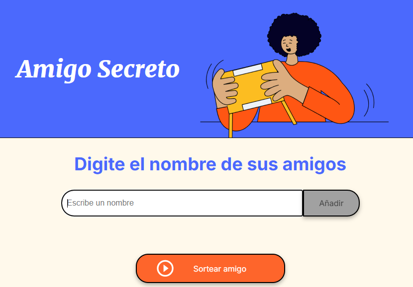
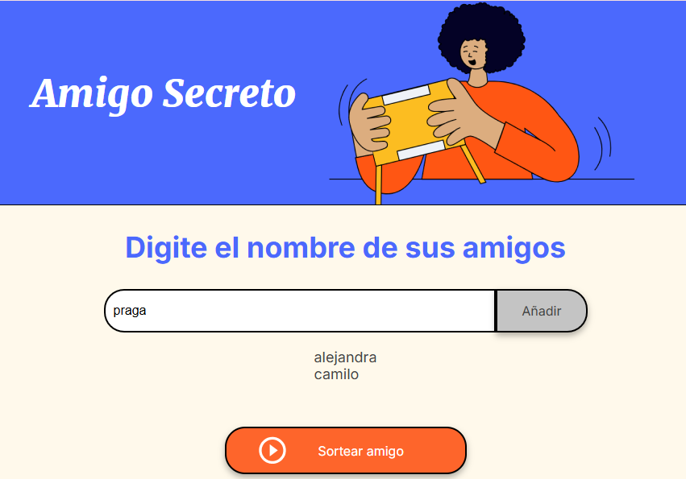
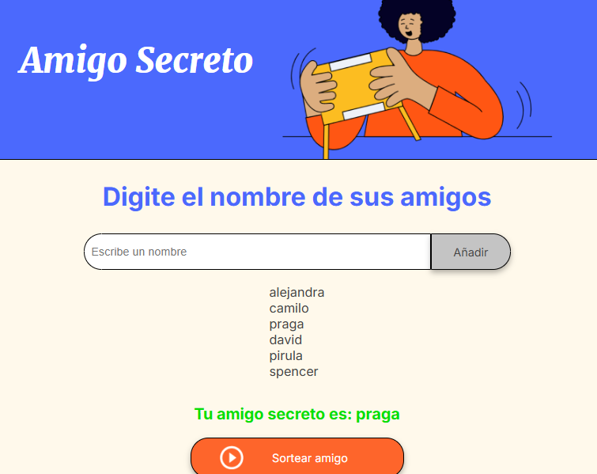

# Challenge: Juego del amigo secreto

Este juego permite sortear de manera aleatoria  cualquier numero de nombres ingresados (personas) que deseen participar y jugar al amigo secreto, de una forma facil y rápida.

# Desarrollo del Juego

**Area de desarollo del juego:** Es el area de todo el desarollo del juego donde registraremos los nombres y haremos el sorteo 

**Registro de participantes:** En el area donde dice ingreso de participantes registramos los nombres que van a entrar en la lista del sorteo, de preferencia los nombres no deben pertirse e ingresar valores en blanco ya que la aplicacion no lo va permitir 

**Sorteo de participantes:** para proceder al sorteo la lista debe tener minimo 3 jugadores, Una vez tenemos la lista de los participantes hacemos click en el boton sortear amigo, al ejecutarse la accion del sorteo aparecera en verde el participante seleccionado de manera aleatoria  

## Tech Stack

JavaScript  
Html   
CSS
